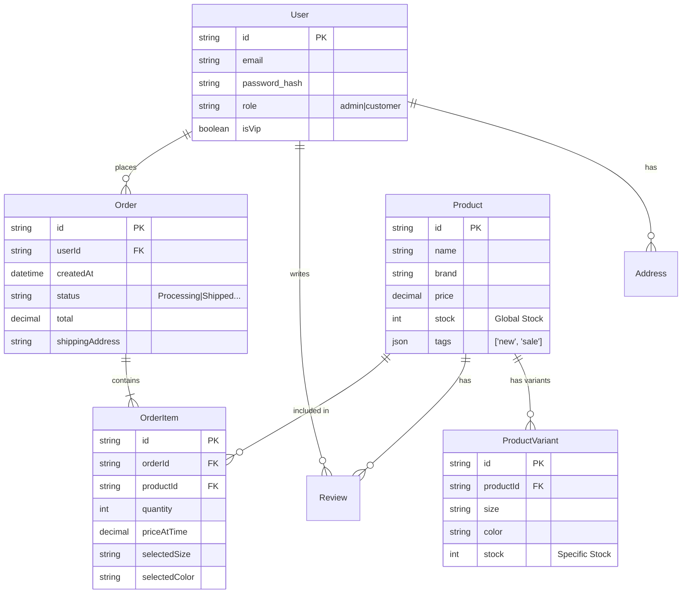

# 🗄️ Database Design (Prisma)

基于 Yapee 电商的需求，我们需要一个能够处理商品变体、库存、订单状态和用户权限的关系型数据库设计。

## 1. ER Diagram (Entity Relationships)



## 2. Prisma Schema Optimization

在 `prisma/schema.prisma` 中，建议进行以下优化以支持高性能查询：

```prisma
model User {
  id        String   @id @default(uuid())
  email     String   @unique
  password  String
  name      String?
  role      Role     @default(CUSTOMER)
  orders    Order[]
  
  // 索引优化
  @@index([email])
}

model Product {
  id            String   @id @default(uuid())
  name          String
  brand         String
  price         Decimal  @db.Decimal(10, 2)
  originalPrice Decimal? @db.Decimal(10, 2)
  image         String
  category      String
  tags          String[] // PostgreSQL Array Type
  
  // 关联
  variants      ProductVariant[]
  orderItems    OrderItem[]
  
  createdAt     DateTime @default(now())
  updatedAt     DateTime @updatedAt

  // 全文搜索索引或特定字段索引
  @@index([category])
  @@index([brand])
}

// 专门处理库存变体 (Size/Color)
model ProductVariant {
  id        String  @id @default(uuid())
  product   Product @relation(fields: [productId], references: [id])
  productId String
  
  size      String
  color     String
  stock     Int     @default(0)

  @@unique([productId, size, color]) // 复合唯一键，防止重复
}

model Order {
  id              String      @id @default(uuid())
  user            User?       @relation(fields: [userId], references: [id])
  userId          String?
  
  items           OrderItem[]
  total           Decimal     @db.Decimal(10, 2)
  status          OrderStatus @default(PROCESSING)
  shippingAddress String
  
  createdAt       DateTime    @default(now())
  
  // 优化按时间查询订单 (Admin Dashboard)
  @@index([createdAt])
  @@index([userId])
}

model OrderItem {
  id            String  @id @default(uuid())
  order         Order   @relation(fields: [orderId], references: [id])
  orderId       String
  product       Product @relation(fields: [productId], references: [id])
  productId     String
  
  quantity      Int
  priceAtTime   Decimal @db.Decimal(10, 2) // 快照价格，防止商品改价影响历史订单
  selectedSize  String
  selectedColor String
}

enum Role {
  CUSTOMER
  ADMIN
}

enum OrderStatus {
  PROCESSING
  SHIPPED
  DELIVERED
  CANCELLED
}
```
