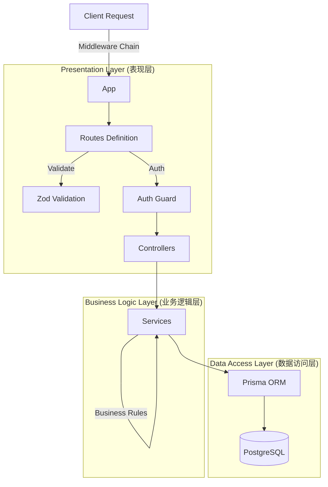

# 🏗️ Backend Architecture

## 1. 系统设计理念 (Design Philosophy)

Yapee 后端采用 **分层架构 (Layered Architecture)**，旨在实现关注点分离 (SoC)、高可测试性和易维护性。



## 2. 核心模块详解

### A. Presentation Layer (表现层)
- **Routes (`/routes`)**: 定义 API端点，仅负责路由分发。
- **Middlewares (`/middleware`)**: 
  - `auth.middleware`: 解析 JWT，注入 `req.user`。
  - `error.middleware`: 全局异常捕获，防止进程崩溃。
  - `validate.middleware`: 基于 Schema 拦截非法请求。
- **Controllers (`/controllers`)**: 
  - 处理 HTTP 请求/响应 (req, res)。
  - **禁止**在此层编写复杂的业务逻辑。
  - **禁止**在此层直接操作数据库。

### B. Business Logic Layer (业务逻辑层)
- **Services (建议在 `/services` 中实现)**:
  - 包含核心业务规则（例如：检查库存是否充足、计算折扣后的总价）。
  - 处理事务 (`prisma.$transaction`)。
  - 即使更换 Web 框架 (如 Express -> Fastify)，此层代码也无需修改。

### C. Data Access Layer (数据访问层)
- **Prisma Client (`db.ts`)**: 类型安全的数据库客户端。
- **Models (`schema.prisma`)**: 定义数据结构和关系。

## 3. 错误处理策略 (Error Handling Strategy)

所有异步错误必须通过 `next(error)` 传递给全局错误处理中间件，或使用 `try/catch` 块捕获并返回标准化的 JSON 错误响应。

```typescript
// Standard Error Response
{
  "success": false,
  "message": "Insufficient stock for product ID: 123",
  "code": "STOCK_ERROR",
  "stack": "..." // Only in development
}
```
