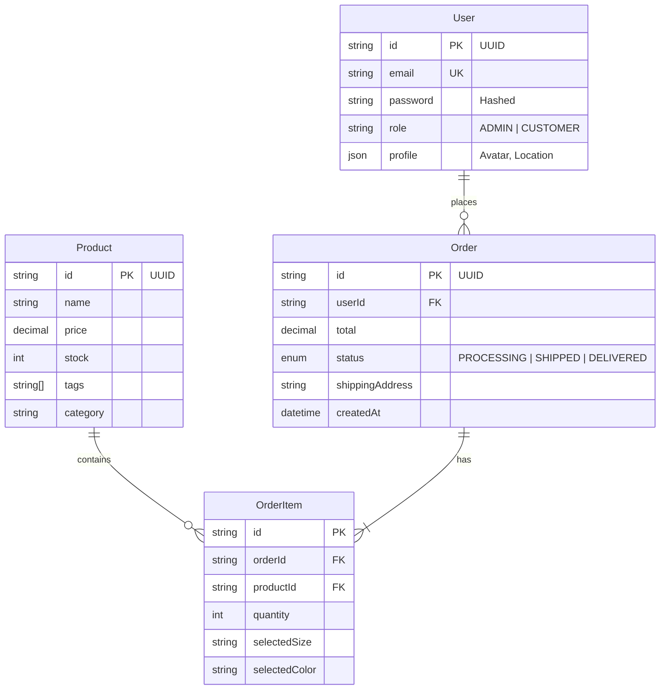

# 🗄️ Database Design

使用 **PostgreSQL** 作为主数据库，通过 **Prisma ORM** 进行管理。

## 1. Entity Relationship Diagram (ERD)

## 2. Prisma Schema Highlights

### User Model
- 使用 `UUID` 作为主键，提高安全性。
- `email` 字段设置唯一索引 (`@unique`)。
- `role` 字段使用 Enum 控制权限。

### Order Model
- 包含 `shippingAddress` 快照，防止用户修改地址后影响历史订单。
- 包含 `subtotal`, `tax`, `total` 字段，避免每次查询都重新计算。

### Performance Optimization
- 在 `Product.category` 和 `Product.tags` 上建议添加索引以加速搜索。
- 在 `Order.userId` 上添加外键索引以加速“我的订单”查询。
